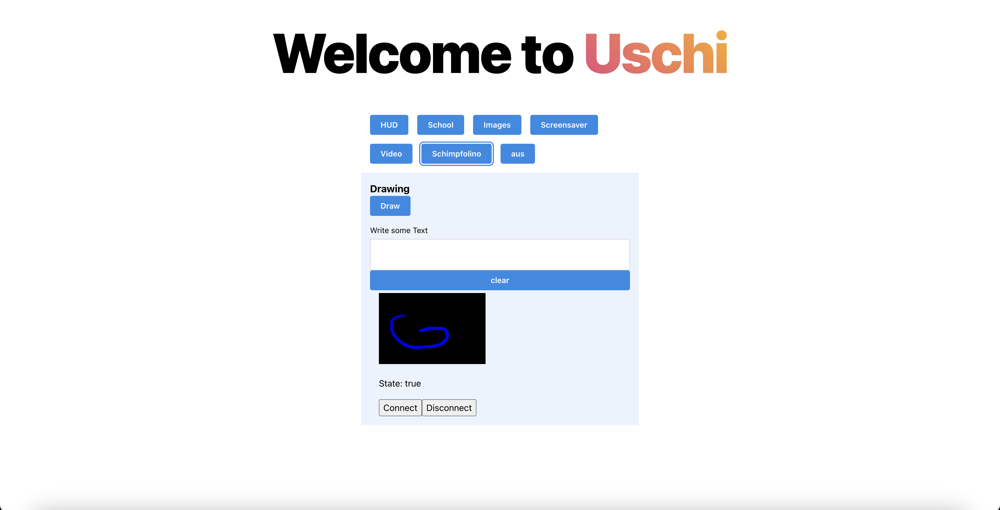

# Uschi Front Door 

 
 

## Features

At Uschis Frontdoor, you can decide which Content to show on Uschi.

- **Public Transport:** BVG-Stations around you
- **3DPrinting:** Status of your running 3D-Print over OctoPrint
- **Calendar:** Display your personal or family Calender
- **School:** Display your childrens lLesson plans
- **Sports:** Display Soccer Results for your preferred leagues via openligaDB
- **Images:** Slide through a defined folder of images
- **Video:** Show (at least) one video
- **Screensaver:** An animation test based on my p5js sketch
- **Draw:** Possibility to draw on LED-Panel via web `Canvas` interface
- **Text:** Write on your Screen via web interface
- **Fun:** Let Uschi insult you with [Schimpfolino](https://github.com/NikolaiRadke/Schimpfolino)

## Installed Programms
- HUD - Iterates through BVG-Stations around you, your calendar and octoPrint
- HUD School - Displays the kids school plans
- Schimpfolino - find out, Beknackter Nasengreis!
- ImageSlider - Displays your Images
- Screensaver - very noisy Screensaver :)
- Vido - Show a prepared video 
- Off - Questions?

# Contribution

## setup

- clone the repo
- `cd frontend/`
- `npm run dev` to start dev server
- `npm run build:uschi` to build frontend und copy to uschi

## npm scripts

## Build and dev scripts

- `dev` – start development server
- `build` – build production version of the app
- `preview` – locally preview production build
- `build:uschi` – build production version and copy to uschi

### Testing scripts

- `typecheck` – checks TypeScript types
- `lint` – runs ESLint
- `prettier:check` – checks files with Prettier
- `vitest` – runs vitest tests
- `vitest:watch` – starts vitest watch
- `test` – runs `vitest`, `prettier:check`, `lint` and `typecheck` scripts

### Other scripts

- `storybook` – starts storybook dev server
- `storybook:build` – build production storybook bundle to `storybook-static`
- `prettier:write` – formats all files with Prettier
